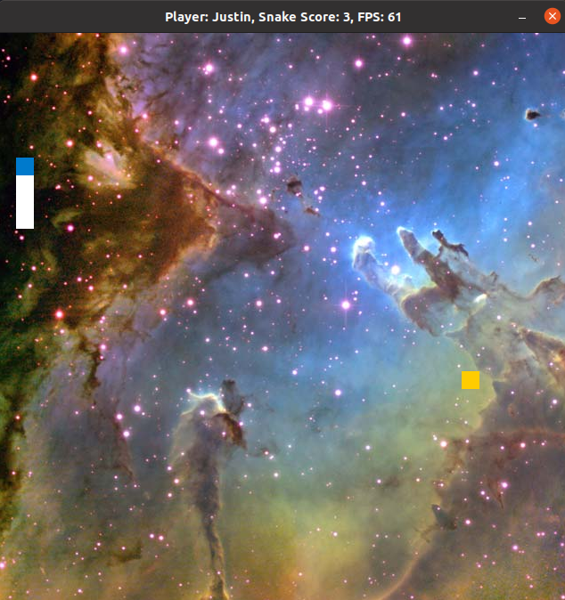
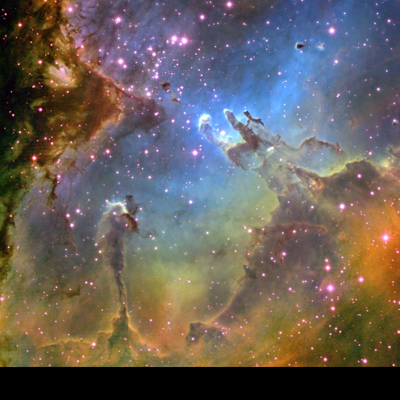
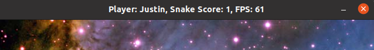
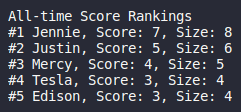

# CPPND: Capstone Snake Game

This project was built on the Capstone project starter repo of [Udacity C++ Nanodegree Program](https://www.udacity.com/course/c-plus-plus-nanodegree--nd213). The code for this repo was inspired by [this](https://codereview.stackexchange.com/questions/212296/snake-game-in-c-with-sdl) excellent StackOverflow post and set of responses.

This project implements additional features utilizing the learning concepts thoughout this program. It includes concepts like pass by reference,

## Gameplay
---
Snake game is a game for you to control a snake and eat as many food as possible, every food counts towards your final score. However, with every food eaten, your snake increases in size (body length), avoid eating your own body why feasting on the food!



## Dependencies for Running Locally
---
* cmake >= 3.7
  * All OSes: [click here for installation instructions](https://cmake.org/install/)
* make >= 4.1 (Linux, Mac), 3.81 (Windows)
  * Linux: make is installed by default on most Linux distros
  * Mac: [install Xcode command line tools to get make](https://developer.apple.com/xcode/features/)
  * Windows: [Click here for installation instructions](http://gnuwin32.sourceforge.net/packages/make.htm)
* SDL2 >= 2.0
  * All installation instructions can be found [here](https://wiki.libsdl.org/Installation)
  >Note that for Linux, an `apt` or `apt-get` installation is preferred to building from source. 
* gcc/g++ >= 5.4
  * Linux: gcc / g++ is installed by default on most Linux distros
  * Mac: same deal as make - [install Xcode command line tools](https://developer.apple.com/xcode/features/)
  * Windows: recommend using [MinGW](http://www.mingw.org/)

## Basic Build Instructions
---
1. Clone this repo.
2. Make a build directory in the top level directory: `mkdir build && cd build`
3. Compile: `cmake .. && make`
4. Run it: `./SnakeGame`.

## Additional Features Added
---
### Background Map
Added background layer so that the snake game can now be played like it's in space.



### Player Name
The game now ask for player's name, display the name on top of the game while playing, and records the score under the name. You can now race to be the top player.



### Scoreboard
The game also stores top 5 scores from previous players of all times, display the scores before the game, and update them after the game.



## Rubric Points Addressed 
---
### Loops, Functions, I/O
1. The project demonstrates an understanding of C++ functions and control structures.
   - ```scoreboard.cpp``` line 36 to 96.

2. The project reads data from a file and process the data, or the program writes data to a file.
   - ```scoreboard.cpp``` line 36 to 66, line 110 to 124.

3. The project accepts user input and processes the input.
   - ```scoreboard.cpp``` line 22 to 33.

### Object Obriented Programming
4. The project uses Object Orientated Programming techniques.
   - Uses both Map and Scoreboard classes to demonstrate, refer to ```map.h``` and ```scoreboard.h```.

5. Classes use appropriate access specifiers for class members.
   - ```map.h``` line 7 to 19, ```scoreboard.h``` line 11 to 48.

6. Class abstract implmentation details from their interfaces.
   - Map object uses the method ```renderTexture()``` (```map.cpp``` line 9 to 40) to hide several steps from loading image to render to screen. 
   - Scoreboard object has the methods ```Start()``` and ```Stop()``` (```scoreboard.cpp``` line 7 to 19) to abstract several steps for a functioning scoreboard.

7. Classes encapsulate behavior.
   - Map and Scoreboard objects hide several attributes and methods that are not required from outside the class in private label. ```map.h``` line 13 to 19, ```scoreboard.h``` line 29 to 48.

### Memory Management

8. The project makes use of references in function declarations.
   - ```scoreboard.h``` line 19, 41, and 47.

## CC Attribution-ShareAlike 4.0 International
---
Shield: [![CC BY-SA 4.0][cc-by-sa-shield]][cc-by-sa]

This work is licensed under a
[Creative Commons Attribution-ShareAlike 4.0 International License][cc-by-sa].

[![CC BY-SA 4.0][cc-by-sa-image]][cc-by-sa]

[cc-by-sa]: http://creativecommons.org/licenses/by-sa/4.0/
[cc-by-sa-image]: https://licensebuttons.net/l/by-sa/4.0/88x31.png
[cc-by-sa-shield]: https://img.shields.io/badge/License-CC%20BY--SA%204.0-lightgrey.svg
